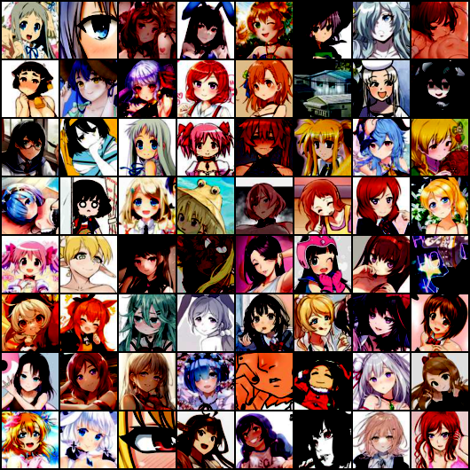

# AnimeGAN

> 애니메이션에 나오는 얼굴 그림을 위한 Generative Adversarial Networks을 PyTorch로 간단하게 구현하였다. 이것은 원작자의 작업 AnimeGAN을 한글화한 것이다. 이것은 https://github.com/jayleicn/animeGAN에서 임포트 하였다.

### Randomly Generated Images

30,667개의 이미지를 이용해서 300번 돌린 결과이다. 중간에 mod collapse에 해당하는 이미지도 나온다.


### Image Interpolation

Manipulating latent codes, enables the transition from images in the first row to the last row.


### Original Images

The images are not clean, some outliers can be observed, which degrades the quality of the generated images.




### Usage

To run the experiment, 

```bash
$ python main.py --dataRoot path_to_dataset/ 
```

The pretrained model for DCGAN are also in this repo, play it inside the jupyter notebook.


### anime-faces 데이터셋

[danbooru.donmai.us](http://danbooru.donmai.us/)로부터 크롤러 툴 [gallery-dl](https://github.com/mikf/gallery-dl)을 사용하여 126개 태그의 이미지를 수집하였다. 이 이미지들을 anime face 검출기 [python-animeface](https://github.com/nya3jp/python-animeface)로 처리하였다. The resulting dataset contains ~143,000 anime faces. Note that some of the tags may no longer meaningful after cropping, i.e. the cropped face images under 'uniform' tag may not contain visible parts of uniforms.

> How to construct the dataset from scratch ?

  Prequisites: gallery-dl, python-animeface

1. anime-style 이미지 다운로드 

   ```bash
   # download 1000 images under the tag "misaka_mikoto"
   gallery-dl --images 1000 "https://danbooru.donmai.us/posts?tags=misaka_mikoto"

   # 한번에 여러개 다운로드. 이 방법은 lnux나 windows bash에서 사용가능하다.
   cat tags.txt | \
   xargs -n 1 -P 12 -I 'tag' \ 
   bash -c ' gallery-dl --range 1-1000 "https://danbooru.donmai.us/posts?tags=$tag" '
   ```
   이 작업을 python을 실행하게 만든 것이 dlimages.py이다.
   ```python
   python dlimages.py
   ```
   실행 시간이 퍽 길어요. 다운로드 중에는 다른 일이나 해야겠습니다.
   126카테고리의 이미지를 1000장씩 다운로드하는데 약 31시간이 걸렸습니다.

2. Extract faces from the downloaded images

   ```python
   import animeface
   from PIL import Image

   im = Image.open('images/anime_image_misaka_mikoto.png')
   faces = animeface.detect(im)
   x,y,w,h = faces[0].face.pos
   im = im.crop((x,y,x+w,y+h))
   im.show() # display
   ```

animeface는 Windows에서는 build가 안 됩니다. 그래서 리눅스에서 돌렸습니다. linux에서는 '''pip install animeface'''하면 설치가 됩니다.


처음 다운로드한 이미지의 갯수는 1000 = 126,000개입니다. 이걸 가지고 animeface를 돌리니까 png파일의 일부는 0byte로 저장이 돼서 삭제해 버렸습니다. 그리고 남은 것이 약 32,000개입니다. 이렇게 잘라낸 얼굴 이미지를 Windows로 옮겨서 검사를 해보니까 얼굴이 아닌 것과, 두 명 이상인 것, 그리고 얼굴이라기에는 좀 조잡한 것들이 약 30% 정도 나옵니다. 이걸 정리하다가 중간에 그만두고 그냥 트레이닝을 시작했습니다.

원작자의 학습 이미지는 아래 사이트에 있습니다. 126태그에 115085장의 이미지라고 합니다.
- Brine (a python-based dataset management library): https://www.brine.io/jayleicn/anime-faces 
- Google Drive: https://drive.google.com/file/d/0B4wZXrs0DHMHMEl1ODVpMjRTWEk/view?usp=sharing
- BaiduYun: https://pan.baidu.com/s/1o8Nxllo

원저자는 상업적 용도로 사용하지 말아달라고 합니다.

여기부터 아래쪽은 원저자의 문서입니다.
### 이번에 배운 것
1. GANs은 학습시키기 정말 어렵다.
2. DCGAN은 일반적으로는 잘 동작한다, 단순하게 완전 연결층을 추가하는 것은 문제를 발생시킨다.
3. 내 경우에 G에 층을 더하는 것이 결과가 좋았다, 이것은 G가 D보다 더 강력해애한다는 뜻이다.
4. D의 입력과 라벨에 노이즈를 추가하면 학습이 안정된다.
5. 입력, 출력의 해상도를 바꿔봤는데 (64x64 vs 96x96), 학습 시에 딱히 드러나는 차이는 없다. 생성된 결과 또한 유사하다.
6. G의 입력에 이진 노이즈(Binray Noise)는 놀랍게 동작한다., 그러나 이미지는 가우시안 노이즈만 못하다(결과가 아우시안만 못하다는 뜻인 듯), 이 아이디어는 다음 사람에게서 빌려왔다 :  @cwhy ['Binary Noise' here I mean a sequence of {-1,1} generated by bernoulli distribution at p=0.5 ]

'6'에 대해서 신중하게 확인하지는 않았다. 만약 당신이 몇몇 일반적인 GAN 팁에 대해 알고싶다면, 다음을 보시라 ; @soumith's [ganhacks](https://github.com/soumith/ganhacks)

### 기타

1. 이 프로젝트는 [chainer-DCGAN](https://github.com/mattya/chainer-DCGAN) 와 [IllustrationGAN](https://github.com/tdrussell/IllustrationGAN)의 영향을 감하게 받았다. 코드의 대부분은  [PyTorch DCGAN example](https://github.com/pytorch/examples/tree/master/dcgan)에서 차용한 것이다. 그들의 깔끔한 코드에 대해 감사드린다.
2. 의존성 : pytorch, torchvision, animeface(ds-chae가 추가)
3. PyTorch 와 GAN을 배우기 위한 장난감 프로젝트이다. 재미를 위한 것이다! :) 어떤 피드백이든지 환영한다.

@jayleicn
